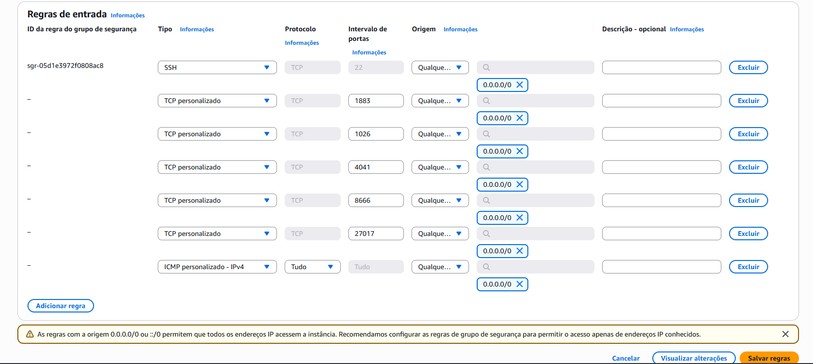
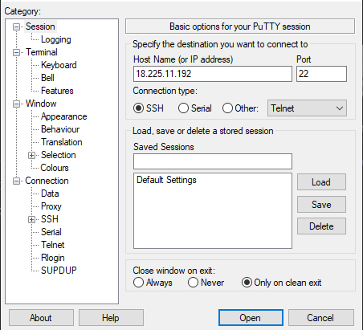
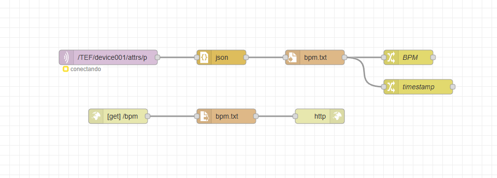

# Sprint 4 – Edge – PassaBola

## Integrantes

| Nome                              | RM     |
| --------------------------        | ------ |
| Kaike Correia de Sousa            | 561623 |
| Artur Rodrigues Trindade Paes     | 564309 |
| Gabriel Silva Novais              | 566370 |
| Marcielle Janguas Pina Carvalho   | 561505 |
| Marcos Vinicius Aquino Prado      | 562775 |

---

## Monitoramento de Batimentos Cardíacos para Atletas

O **PassaBola** realiza **leitura e monitoramento de BPM** em tempo real usando um **ESP32**, enviando dados para uma interface web com gráficos dinâmicos.
O objetivo é acompanhar a **frequência cardíaca durante treinos**, identificando quando o BPM está acima do limite e gerando alertas visuais e sonoros.

---

## Contexto

* Avaliar esforço cardiovascular em tempo real
* Identificar zonas ideais de treino: resistência, aeróbico ou queima de gordura
* Medir evolução física: BPM de repouso mais baixo indica melhor condicionamento
* Permite ajustes precisos no treino e prevenção de esforço excessivo

---

## Funcionalidades do Protótipo

| Funcionalidade          | Comportamento                       |
| ----------------------- | ----------------------------------- |
| Leitura contínua de BPM | Sensor envia dados ao ESP32         |
| Envio de dados          | Via MQTT para servidor              |
| Processamento           | Node-RED salva e processa os dados  |
| Visualização            | Gráfico em tempo real na página web |
| BPM acima do limite     | LED vermelho + buzzer acionados     |
| BPM normal              | LED verde aceso                     |

---

## Testes Realizados

| Ambiente                      | Status |
| ----------------------------- | ------ |
| Simulação Wokwi               | ✅      |
| ESP32 físico (presencial)     | ✅      |
| Integração Node-RED / Postman | ✅      |

---

## Tecnologias Utilizadas


---

## Vídeo Demonstrativo

**YouTube:** *[link]*

---

## Guia Rápido: Instância EC2 na AWS

1. Acesse: [AWS EC2 Console](https://aws.amazon.com/pt/ec2/)
2. Clique em **Launch Instance**
3. Configuração: Ubuntu, tipo t3, par de chaves PPK, memória conforme necessidade
4. **Security Group** – libere as portas:

| Porta     | Uso              |
| --------- | ---------------- |
| 1883      | MQTT             |
| 1026      | Orion            |
| 4041      | API / IoT Agent  |
| 8666      | Serviço auxiliar |
| 27017     | MongoDB          |
| ICMP IPv4 | Ping             |

5. Salve o **IP público** da instância



---

## 🔑 Acesso via PuTTY

* **IP:** *[IP da VM]*
* **Key:** *[arquivo PPK]*
* Clique em **Open**



---

## Instalação do FIWARE Broker via Docker

```bash
sudo apt update
sudo apt-get install net-tools git
sudo apt install apt-transport-https ca-certificates curl software-properties-common
curl -fsSL https://download.docker.com/linux/ubuntu/gpg | sudo apt-key add -
sudo add-apt-repository "deb [arch=amd64] https://download.docker.com/linux/ubuntu focal stable"
sudo apt update
sudo apt install docker-ce
sudo systemctl status docker
git clone https://github.com/fabiocabrini/fiware
cd fiware
sudo docker compose up -d
sudo docker stats
```

---

## Postman

1. Baixe o JSON:
   [FIWARE Descomplicado.postman_collection.json](https://github.com/fabiocabrini/fiware/blob/main/FIWARE%20Descomplicado.postman_collection.json)
2. Importe no Postman
3. Substitua a URL pelo **IP da EC2** nos 3 GETs

---

## Node-RED – Fluxo de Dados

| Bloco | Tipo          | Configuração                               |
| ----- | ------------- | ------------------------------------------ |
| 1     | MQTT IN       | IP:1883 / Tópico: `/TEF/device001/attrs/p` |
| 2     | JSON          | -                                          |
| 3     | WRITE FILE    | `bpm.txt` → sobrescrever                   |
| 4     | CHANGE        | payload → BPM                              |
| 5     | CHANGE        | payload.timestamp                          |
| 6     | HTTP IN       | GET /bpm                                   |
| 7     | READ FILE     | bpm.txt                                    |
| 8     | HTTP RESPONSE | -                                          |



---

## Materiais Utilizados

* ESP32
* Sensor de Pulso (A0)
* LED Verde (pino 10)
* LED Vermelho (pino 9)
* Buzzer piezo (pino 11)
* Resistores (220Ω)
* RTC DS3231 (I2C)
* Protoboard + jumpers

---

## Principais Bibliotecas

* PulseSensorPlayground.h
* ArduinoJson.h
* Wire.h
* RTClib.h
* WiFi.h
* PubSubClient.h

---

## Código e Demonstrações

* **ESP32 – Código Final**

```#include <ArduinoJson.h>
#include <RTClib.h>
#include <Wire.h>
#include <WiFi.h>
#include <PubSubClient.h>

// ===== Config Wi-Fi / MQTT =====
const char* WIFI_SSID         = "Wokwi-GUEST";
const char* WIFI_PASSWORD     = "";
const char* BROKER_MQTT       = "3.144.236.56";
const int   MQTT_PORT         = 1883;
const char* TOPIC_SUB         = "/TEF/device001/cmd";
const char* TOPIC_PUB_ATTRS   = "/TEF/device001/attrs/p";
const char* MQTT_ID           = "fiware_001";

WiFiClient espClient;
PubSubClient mqtt(espClient);

// ===== Hardware =====
const int PIN_LED_VERDE   = 16;
const int PIN_LED_VERMELHA= 4;
const int PIN_SENSOR_POT  = 34;
const int PIN_BUZZER      = 14;
const int PIN_LED_ONBOARD = 2;

// ===== Variáveis =====
int bpmConvertido = 0;
RTC_DS1307 rtc;

// ----------------------------------------------------------------------------------

void connectWiFi() {
  WiFi.begin(WIFI_SSID, WIFI_PASSWORD);
  while (WiFi.status() != WL_CONNECTED) {
    delay(100);
    Serial.print(".");
  }
  Serial.println("\nWi-Fi conectado: " + WiFi.localIP().toString());
}

void mqttCallback(char* topic, byte* payload, unsigned int length) {
  String msg;
  for (unsigned int i = 0; i < length; i++) msg += (char)payload[i];
  Serial.println("cmd: " + msg);

  if (msg == "device001@on|")  digitalWrite(PIN_LED_ONBOARD, HIGH);
  if (msg == "device001@off|") digitalWrite(PIN_LED_ONBOARD, LOW);
}

void connectMQTT() {
  while (!mqtt.connected()) {
    Serial.print("Conectando MQTT...");
    if (mqtt.connect(MQTT_ID)) {
      Serial.println("OK");
      mqtt.subscribe(TOPIC_SUB);
    } else {
      Serial.println("falhou.");
      delay(2000);
    }
  }
}

// ----------------------------------------------------------------------------------

void setup() {
  Serial.begin(9600);

  pinMode(PIN_LED_VERDE, OUTPUT);
  pinMode(PIN_LED_VERMELHA, OUTPUT);
  pinMode(PIN_LED_ONBOARD, OUTPUT);
  pinMode(PIN_BUZZER, OUTPUT);

  connectWiFi();

  mqtt.setServer(BROKER_MQTT, MQTT_PORT);
  mqtt.setCallback(mqttCallback);

  if (!rtc.begin()) {
    Serial.println("erro RTC");
    while (true);
  }
}

// ----------------------------------------------------------------------------------

void loop() {
  if (WiFi.status() != WL_CONNECTED) connectWiFi();
  if (!mqtt.connected()) connectMQTT();
  mqtt.loop();

  // simula leitura do batimento
  int raw = analogRead(PIN_SENSOR_POT);
  bpmConvertido = map(raw, 0, 4095, 0, 220);

  DateTime now = rtc.now();

  // ISO8601
  char isoTime[25];
  sprintf(isoTime, "%04d-%02d-%02dT%02d:%02d:%02dZ",
          now.year(), now.month(), now.day(),
          now.hour(), now.minute(), now.second());

  StaticJsonDocument<256> json;
  json["BPM"]       = bpmConvertido;
  json["timestamp"] = isoTime;

  char buffer[256];
  serializeJson(json, buffer);

  mqtt.publish(TOPIC_PUB_ATTRS, buffer);
  Serial.println(buffer);

  // indicação
  if (bpmConvertido < 110) {
    digitalWrite(PIN_LED_VERDE, HIGH);
    digitalWrite(PIN_LED_VERMELHA, LOW);
    noTone(PIN_BUZZER);
    Serial.println("BPM normal");
  } else {
    digitalWrite(PIN_LED_VERDE, LOW);
    digitalWrite(PIN_LED_VERMELHA, HIGH);
    tone(PIN_BUZZER, 400);
    Serial.println("BPM alto");
  }

  delay(1000);
}
```

* **Arduino – Código de Leitura BPM**
```#include <PulseSensorPlayground.h>
#include <ArduinoJson.h>
#include <Wire.h>
#include <RTClib.h>

// Hardware
#define PINO_PULSO A0
const int LED_OK = 10;
const int LED_ALERTA = 9;
const int BUZZER = 11;

// Objetos principais
PulseSensorPlayground sensorPulso;
RTC_DS1307 rtc;

// BPM
int bpmAtual = 0;
int ultimoBpmValido = 0;
const int LIMITE_BPM = 150;

void setup() {
  pinMode(LED_OK, OUTPUT);
  pinMode(LED_ALERTA, OUTPUT);
  pinMode(BUZZER, OUTPUT);

  Serial.begin(9600);

  sensorPulso.analogInput(PINO_PULSO);
  sensorPulso.setThreshold(513);
  sensorPulso.begin();

  if (!rtc.begin()) {
    Serial.println("Erro ao iniciar RTC");
    while (true);
  }

  // rtc.adjust(DateTime(F(__DATE__), F(__TIME__)));  // só usar 1x
}

void loop() {
  // leitura do sensor
  bpmAtual = sensorPulso.getBeatsPerMinute();
  bool novoBeat = sensorPulso.sawStartOfBeat();

  if (novoBeat && bpmAtual > 0) {
    ultimoBpmValido = bpmAtual;
  }

  // horário atual
  DateTime agora = rtc.now();
  
  StaticJsonDocument<256> json;
  json["BPM"] = ultimoBpmValido;

  char horario[20];
  sprintf(horario, "%04d%02d%02d%02d%02d",
          agora.year(),
          agora.month(),
          agora.day(),
          agora.hour(),
          agora.minute());

  json["timestamp"] = horario;

  String saida;
  serializeJson(json, saida);
  Serial.println(saida);

  // controle de indicação
  if (novoBeat && ultimoBpmValido > 0) {
    if (ultimoBpmValido < LIMITE_BPM) {
      digitalWrite(LED_OK, HIGH);
      digitalWrite(LED_ALERTA, LOW);
      noTone(BUZZER);
      Serial.println("BPM normal");
    } else {
      digitalWrite(LED_OK, LOW);
      digitalWrite(LED_ALERTA, HIGH);
      tone(BUZZER, 400);
      Serial.println("BPM acima do limite!");
    }
  }

  delay(100);
}
```

* **HTML/JS – Gráfico em Tempo Real**
```<section>
  <div id="card-bpm-area">
    <h1>Monitoramento de BPM em Tempo Real</h1>

    <canvas id="graficoBPM" width="600" height="300"></canvas>

    <div>
      <p>Batimentos Atuais: <span id="valorBPM">--</span> BPM</p>
      <p>Horário da Leitura: <span id="horarioLeitura">--</span></p>
    </div>
  </div>
</section>

<script src="https://cdn.jsdelivr.net/npm/chart.js"></script>

<script>
  // gráfico base
  const contexto = document.getElementById("graficoBPM").getContext("2d");
  const grafico = new Chart(contexto, {
    type: "line",
    data: {
      labels: [],
      datasets: [
        {
          label: "Frequência Cardíaca (BPM)",
          data: [],
          borderColor: "red",
          backgroundColor: "rgba(255,0,0,0.25)",
          borderWidth: 2,
          tension: 0.25
        }
      ]
    },
    options: {
      responsive: true,
      scales: {
        x: {
          title: { display: true, text: "Horário" }
        },
        y: {
          beginAtZero: true,
          title: { display: true, text: "Batimentos" }
        }
      }
    }
  });

  // função de atualização
  async function obterDados() {
    try {
      const resposta = await fetch("http://localhost:1880/dados");
      const dados = await resposta.json();

      console.log("dados recebidos:", dados);

      document.getElementById("valorBPM").innerText = dados.BPM;
      document.getElementById("horarioLeitura").innerText = dados.timestamp;

      grafico.data.labels.push(dados.timestamp);
      grafico.data.datasets[0].data.push(dados.BPM);

      // mantém o histórico limitado
      if (grafico.data.labels.length > 20) {
        grafico.data.labels.shift();
        grafico.data.datasets[0].data.shift();
      }

      grafico.update();
    } catch (err) {
      console.log("erro ao consultar:", err);
    }
  }

  // loop automático
  setInterval(obterDados, 5000);
  obterDados();
</script>
```

---

